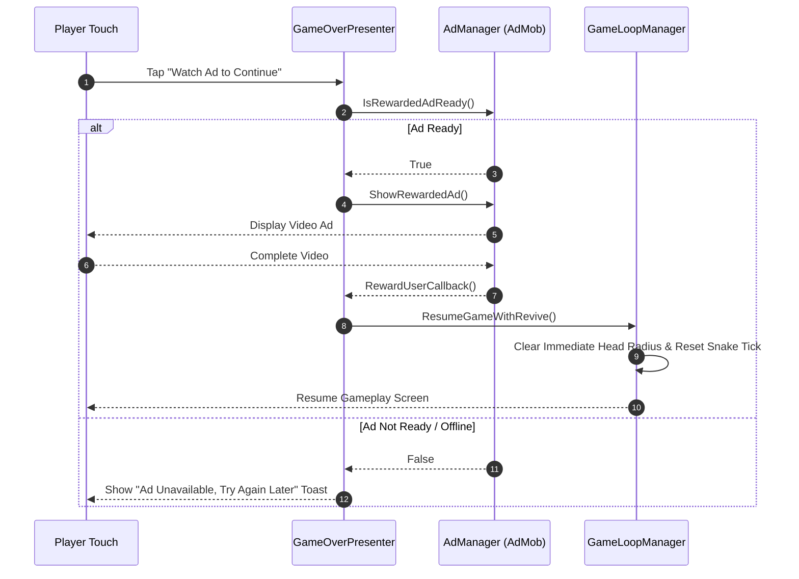

# Software Architecture & System Design Document (SDD)
## Neon Snake: Light

**Document Version:** 1.0  
**Status:** Approved for Implementation  
**Standard Compliance:** IEEE Std 1016-2009 (Software Design Descriptions)  
**Target Platform:** Android (ARM64 / ARMv7)  
**Game Engine:** Unity (2022.3 LTS / 2023 LTS)  
**Programming Language:** C# (.NET Standard 2.1)  
**Based On:** SRS v1.0 (`Neon_Snake_Light_IEEE_SRS.md`)  
**Date:** 28 August 2026  
**Author:** Software Architect & Principal Software Engineering Team  

---

## Executive Summary

This **Software Design Document (SDD)** establishes the detailed software architecture, subsystem layouts, component interactions, class contracts, data models, and non-functional execution strategies for **Neon Snake: Light**. 

Designed as a high-performance, lightweight, modular mobile game, the architecture utilizes a decoupled **Model-View-Presenter (MVP)** pattern augmented by an **Event-Driven Observer Architecture** and pure C# Domain Logic isolated from Unity Engine MonoBehaviours. This design ensures sub-15MB deployment size, zero garbage-collection allocations during gameplay ticks, 30–60 FPS hardware performance across low-to-mid end Android hardware, and high extensibility for future level/mode rollouts.

---

## Table of Contents

1. [Architectural Goals & Constraints](#1-architectural-goals--constraints)
2. [High-Level System Architecture](#2-high-level-system-architecture)
3. [Subsystem & Component Breakdown](#3-subsystem--component-breakdown)
4. [Class Hierarchy & Interface Specifications](#4-class-hierarchy--interface-specifications)
5. [State Machine Architecture](#5-state-machine-architecture)
6. [Data Architecture & Serialization Schemas](#6-data-architecture--serialization-schemas)
7. [Sequence & Interaction Diagrams](#7-sequence--interaction-diagrams)
8. [Non-Functional Optimization Strategy](#8-non-functional-optimization-strategy)
9. [Verification & Automated Testing Strategy](#9-verification--automated-testing-strategy)
10. [SRS Requirements Traceability Matrix](#10-srs-requirements-traceability-matrix)

---

# 1. Architectural Goals & Constraints

### 1.1 Architectural Goals
- **Decoupled Architecture:** Separation of pure game rules (Snake movement, collision, scoring) from Unity visual rendering and OS hardware APIs.
- **Zero-Allocation Core Loop:** Elimination of heap allocations inside the main game execution tick (`Update` / `FixedUpdate`) to guarantee zero Garbage Collection (GC) pauses.
- **Lightweight Footprint:** Strict asset management and code stripping targeting an APK size $\le 15\text{ MB}$.
- **Extensibility:** Polymorphic Game Mode interface (`IGameMode`) permitting rapid deployment of Classic, Time Attack, Level, and Ghost Modes without core modification.
- **Offline Integrity & Resiliency:** Robust fallback mechanisms when offline or when external services (e.g. Google AdMob) are unreachable.

### 1.2 System Constraints
- **Platform:** Android 7.0 (API Level 24) or higher.
- **Engine:** Unity Engine with C# scripting standard.
- **Display:** Dynamic aspect ratio support (16:9, 18:9, 19.5:9, 20:9) in Portrait mode.
- **Input:** Single-touch swipe gestures and virtual Touch D-Pad UI overlay.
- **Storage:** Local binary / JSON storage backed by unity `PlayerPrefs` and encrypted obfuscation for high-score integrity.

---

# 2. High-Level System Architecture

The system follows a multi-tier layered architecture combining **Model-View-Presenter (MVP)** for UI separation and **Component-Based Architecture with Object Pooling** for engine entities.

```
+-----------------------------------------------------------------------+
|                             USER LAYER                                |
|        (Touch Screen, Screen Orientations, Device Audio/Haptics)      |
+-----------------------------------+-----------------------------------+
                                    |
                                    v
+-----------------------------------------------------------------------+
|                    PRESENTATION / VIEW LAYER                          |
|  +-------------------+  +-------------------+  +-------------------+  |
|  |   MainMenuView    |  |   GameplayView    |  |   GameOverView    |  |
|  +-------------------+  +-------------------+  +-------------------+  |
|  +-------------------+  +-------------------+  +-------------------+  |
|  | DirectionalButtons|  |  SwipeGestureArea |  | DynamicThemeSkin  |  |
|  +-------------------+  +-------------------+  +-------------------+  |
+-----------------------------------+-----------------------------------+
                                    | Events / Delegates
                                    v
+-----------------------------------------------------------------------+
|                    APPLICATION / PRESENTER LAYER                      |
|  +-------------------+  +-------------------+  +-------------------+  |
|  | GameStatePresenter|  |  ScorePresenter   |  | SettingsPresenter |  |
|  +-------------------+  +-------------------+  +-------------------+  |
|  +-------------------+  +-------------------+  +-------------------+  |
|  | GameModeController|  | GhostModeController|  |  AdIntegration    |  |
|  +-------------------+  +-------------------+  +-------------------+  |
+-----------------------------------+-----------------------------------+
                                    | Commands / Domain Interface
                                    v
+-----------------------------------------------------------------------+
|                       DOMAIN / CORE GAME ENGINE                       |
|  +-------------------+  +-------------------+  +-------------------+  |
|  |  SnakeController  |  |   GridManager     |  | CollisionEngine   |  |
|  +-------------------+  +-------------------+  +-------------------+  |
|  |   FoodManager     |  |   ScoreModel      |  |  ObjectPooler     |  |
|  +-------------------+  +-------------------+  +-------------------+  |
+-----------------------------------+-----------------------------------+
                                    |
                                    v
+-----------------------------------------------------------------------+
|                   INFRASTRUCTURE / HARDWARE LAYER                     |
|  +-------------------+  +-------------------+  +-------------------+  |
|  | PlayerPrefsStorage|  | AndroidShareNative|  | GoogleAdMobBridge |  |
|  +-------------------+  +-------------------+  +-------------------+  |
|  | AudioService      |  | HapticService     |  | UnityEngineSystem |  |
|  +-------------------+  +-------------------+  +-------------------+  |
+-----------------------------------------------------------------------+
```

---

# 3. Subsystem & Component Breakdown

### 3.1 Input Subsystem
- **`InputManager`**: Central processor listening to touch screen events.
- **`SwipeInputHandler`**: Converts touch drag vectors into discrete Cardinal Directions (`UP`, `DOWN`, `LEFT`, `RIGHT`) based on configurable pixel thresholds.
- **`ButtonInputHandler`**: Translates UI button presses into direction commands.

### 3.2 Core Gameplay & Physics Subsystem
- **`GridManager`**: Maintains logical 2D grid coordinates $(X, Y)$ independent of screen pixels. Maps grid units to Unity world space.
- **`SnakeController`**: Manages the queue of grid coordinates representing the Snake's head and body. Implements direction change buffer to prevent instant 180° reversals within a single game tick.
- **`FoodManager`**: Manages food generation. Queries `GridManager` for unoccupied grid cells to place normal and special food items.
- **`CollisionEngine`**: Validates head position against grid boundaries, self-body segments, and obstacle arrays on every movement tick.

### 3.3 Game Mode Subsystem
- **`GameModeManager`**: Lifecycle manager orchestrating the active `IGameMode`.
- **`ClassicGameMode`**: Handles endless gameplay with dynamic speed ramping ($\text{Speed} = \text{BaseSpeed} \times \gamma^{\text{Score}}$).
- **`TimeAttackGameMode`**: Controls fixed 60-second countdown timer and score calculation.
- **`LevelGameMode`**: Loads level configurations, static obstacles, and win/lose goals.
- **`GhostGameMode`**: Streams recorded ghost frames into a secondary visual Snake object.

### 3.4 Services & Persistence Subsystem
- **`SaveSystem`**: Encapsulates data saving/loading with checksum validation to prevent local score file manipulation.
- **`AudioManager`**: Sound-pool manager playing SFX via pre-allocated Unity `AudioSource` instances.
- **`HapticsManager`**: Interfacing with `Vibrator` Android API for tactical vibration feedback.
- **`AdManager`**: Wrapper for Google Mobile Ads (AdMob) handling interstitial and rewarded video callbacks.
- **`ShareService`**: Native Android intent bridge for score image and text sharing.

---

# 4. Class Hierarchy & Interface Specifications

### 4.1 Core Domain Interfaces

```csharp
namespace NeonSnake.Core
{
    public enum Direction { Up, Down, Left, Right, None }

    public struct GridPosition
    {
        public int X;
        public int Y;

        public GridPosition(int x, int y)
        {
            X = x;
            Y = y;
        }

        public static bool operator ==(GridPosition a, GridPosition b) => a.X == b.X && a.Y == b.Y;
        public static bool operator !=(GridPosition a, GridPosition b) => !(a == b);
    }

    public interface ISnakeInputProvider
    {
        event System.Action<Direction> OnDirectionRequested;
        void EnableInput();
        void DisableInput();
    }

    public interface IGameMode
    {
        string ModeId { get; }
        void InitializeMode();
        void OnTick(float deltaTime);
        void OnFoodEaten(int points);
        bool CheckGameOverCondition();
        void TeardownMode();
    }

    public interface ISaveProvider
    {
        void SaveData<T>(string key, T data);
        T LoadData<T>(string key, T defaultValue);
        bool HasKey(string key);
    }
}
```

### 4.2 Snake Domain Controller (`SnakeController.cs`)

```csharp
using System;
using System.Collections.Generic;
using UnityEngine;

namespace NeonSnake.Core
{
    public class SnakeController : MonoBehaviour
    {
        [Header("Grid Config")]
        [SerializeField] private Vector2Int gridSize = new Vector2Int(20, 30);
        
        private readonly List<GridPosition> bodyParts = new List<GridPosition>();
        private Direction currentDirection = Direction.Right;
        private Direction pendingDirection = Direction.Right;
        
        public GridPosition HeadPosition => bodyParts[0];
        public IReadOnlyList<GridPosition> BodyParts => bodyParts;

        public event Action<GridPosition> OnHeadMoved;
        public event Action<GridPosition> OnTailRemoved;
        public event Action OnGrown;

        public void Initialize(GridPosition startPos, int initialLength)
        {
            bodyParts.Clear();
            for (int i = 0; i < initialLength; i++)
            {
                bodyParts.Add(new GridPosition(startPos.X - i, startPos.Y));
            }
            currentDirection = Direction.Right;
            pendingDirection = Direction.Right;
        }

        public void RequestDirectionChange(Direction newDirection)
        {
            // FR-04: Prevent immediate 180-degree turn validation
            if (IsOppositeDirection(currentDirection, newDirection)) return;
            pendingDirection = newDirection;
        }

        public void StepForward(bool growNextStep)
        {
            currentDirection = pendingDirection;
            GridPosition newHead = CalculateNextHeadPosition(bodyParts[0], currentDirection);

            bodyParts.Insert(0, newHead);
            OnHeadMoved?.Invoke(newHead);

            if (!growNextStep)
            {
                int lastIndex = bodyParts.Count - 1;
                GridPosition removedTail = bodyParts[lastIndex];
                bodyParts.RemoveAt(lastIndex);
                OnTailRemoved?.Invoke(removedTail);
            }
            else
            {
                OnGrown?.Invoke();
            }
        }

        private bool IsOppositeDirection(Direction current, Direction requested)
        {
            return (current == Direction.Up && requested == Direction.Down) ||
                   (current == Direction.Down && requested == Direction.Up) ||
                   (current == Direction.Left && requested == Direction.Right) ||
                   (current == Direction.Right && requested == Direction.Left);
        }

        private GridPosition CalculateNextHeadPosition(GridPosition current, Direction dir)
        {
            return dir switch
            {
                Direction.Up => new GridPosition(current.X, current.Y + 1),
                Direction.Down => new GridPosition(current.X, current.Y - 1),
                Direction.Left => new GridPosition(current.X - 1, current.Y),
                Direction.Right => new GridPosition(current.X + 1, current.Y),
                _ => current
            };
        }
    }
}
```

### 4.3 Collision Detection Engine (`CollisionEngine.cs`)

```csharp
namespace NeonSnake.Core
{
    public class CollisionEngine
    {
        private readonly int gridWidth;
        private readonly int gridHeight;

        public CollisionEngine(int width, int height)
        {
            gridWidth = width;
            gridHeight = height;
        }

        public bool IsWallCollision(GridPosition head)
        {
            return head.X < 0 || head.X >= gridWidth || head.Y < 0 || head.Y >= gridHeight;
        }

        public bool IsSelfCollision(GridPosition head, IReadOnlyList<GridPosition> body)
        {
            // Start checking from index 1 (skip head itself)
            for (int i = 1; i < body.Count; i++)
            {
                if (head == body[i]) return true;
            }
            return false;
        }
    }
}
```

---

# 5. State Machine Architecture

The game lifecycle is driven by a deterministic Finite State Machine (FSM).

```
                      +-------------------+
                      |   Boot / Splash   |
                      +---------+---------+
                                |
                                v
                      +-------------------+
             +------->|     MainMenu      |<-------+
             |        +---------+---------+        |
             |                  |                  |
             |                  v                  |
             |        +-------------------+        |
             |        |   Skin Selection  |        |
             |        +---------+---------+        |
             |                  |                  |
             |                  v                  |
             |        +-------------------+        |
             |        |     GameLoop      |        |
             |        +----+---------+----+        |
             |             |         |             |
             |      Pause  |         | Game Over   |
             |             v         v             |
             |     +---------------+ +---------------+
             |     |   PausedState | | GameOverState |
             |     +-------+-------+ +-------+-------+
             |             |                 |       |
             +-------------+                 | Watch | Rewarded
             | (Return Menu)                 v Ad    | Ad
             |                       +---------------+
             +-----------------------| RewardedState |
                                     +---------------+
```

### State Definition Table
| State Name | Responsibilities | Permitted Transitions |
|---|---|---|
| `BootState` | Asset Preloading, Save Data Verification, AdMob Initialization | `MainMenuState` |
| `MainMenuState` | Menu UI Rendering, High Score Display, Mode Selection | `GameLoopState`, `SkinSelectionState` |
| `GameLoopState` | Active Gameplay Ticks, Snake Movement, Input Dispatching | `PausedState`, `GameOverState` |
| `PausedState` | Freezes Game Time, Displays Pause UI | `GameLoopState`, `MainMenuState` |
| `GameOverState` | Final Score Processing, High Score Evaluation, Share Option | `MainMenuState`, `RewardedState`, `GameLoopState` |
| `RewardedState` | Plays AdMob Rewarded Video, Resumes Game on Success | `GameLoopState`, `GameOverState` |

---

# 6. Data Architecture & Serialization Schemas

### 6.1 Data Structures & Models

#### Save Data Transfer Object (`SaveData.cs`)
```csharp
[System.Serializable]
public class SaveData
{
    public int HighScoreClassic = 0;
    public int HighScoreTimeAttack = 0;
    public int SelectedSkinId = 0;
    public int SelectedThemeId = 0; // 0: Dark, 1: Light
    public bool SoundEnabled = true;
    public bool VibrationEnabled = true;
    public int ControlType = 0; // 0: Swipe, 1: On-Screen Buttons
    public List<int> UnlockedSkinIds = new List<int> { 0 };
    public string SecurityHash = "";
}
```

#### Ghost Performance Serialization (`GhostData.cs`)
```csharp
[System.Serializable]
public struct GhostFrame
{
    public float Timestamp;
    public int Direction;
    public int HeadX;
    public int HeadY;
}

[System.Serializable]
public class GhostRecording
{
    public int FinalScore;
    public float TotalDuration;
    public List<GhostFrame> Frames = new List<GhostFrame>();
}
```

### 6.2 Data Integrity & Security Layer
To meet **NFR-04** and **NFR-09**, high-score tampering is prevented using an HMAC-SHA256 checksum stored inside `SaveData.SecurityHash`:

$$\text{SecurityHash} = \text{HMAC-SHA256}(\text{HighScoreClassic} + \text{HighScoreTimeAttack} + \text{DeviceId}, \text{SecretSalt})$$

On game launch, the `SaveSystem` verifies the computed hash against the stored hash. If mismatch occurs (tampering detected), high scores revert to validated backup states.

---

# 7. Sequence & Interaction Diagrams

### 7.1 Game Tick & Food Consumption Sequence

```mermaid
sequenceDiagram
    autonumber
    participant Loop as GameLoopManager
    participant Input as InputHandler
    participant Snake as SnakeController
    participant Physics as CollisionEngine
    participant Food as FoodManager
    participant Audio as AudioManager
    participant UI as GameplayUI

    Loop->>Input: Poll Pending Direction
    Input-->>Loop: Returns Direction
    Loop->>Snake: RequestDirectionChange(Dir)
    Loop->>Snake: StepForward(growNextStep=false)
    Snake-->>Loop: OnHeadMoved(NewHeadPos)
    Loop->>Physics: CheckWallOrSelfCollision(HeadPos)
    alt Collision Detected
        Physics-->>Loop: Collision = True
        Loop->>Loop: TriggerGameOver()
    else Safe Grid Position
        Physics-->>Loop: Collision = False
        Loop->>Food: CheckFoodCollision(HeadPos)
        alt Food Eaten
            Food-->>Loop: Returns Points (e.g. +10)
            Loop->>Snake: SetNextStepGrow(true)
            Loop->>Audio: PlaySound("eat_sfx")
            Loop->>UI: UpdateScoreDisplay(NewScore)
            Loop->>Food: SpawnNewFood()
        end
    end
```

### 7.2 Rewarded Ad Continue Flow



---

# 8. Non-Functional Optimization Strategy

### 8.1 Memory & Garbage Collection Optimization
1. **Object Pooling Pattern:** Pre-allocates `SnakeSegmentView` objects (capacity: 100) and `FoodView` items during `BootState`. Zero dynamic `Instantiate()` or `Destroy()` calls during gameplay.
2. **Struct Usage:** Use `GridPosition` value-type structs instead of class objects for positional calculations.
3. **Cached String Identifiers:** Pre-hash UI animator properties using `Animator.StringToHash()` and reuse constant sound identifier strings.

### 8.2 Performance & Battery Optimization (NFR-01)
- **Target Frame Rate:** Explicitly cap execution to 30 FPS (`Application.targetFrameRate = 30`) on low-end hardware, with optional 60 FPS toggle on high-end profiles.
- **Fixed Tick Frequency:** Game logic update ticks run on a configurable timer (e.g. 0.15s tick rate) rather than per-frame rendering `Update()`.

### 8.3 Package Size Reduction Strategy (NFR-02 < 15 MB)
- **Texture Compression:** Convert all UI and Neon sprites to 2D Texture Atlases using **ASTC 6x6 / 8x8** compression.
- **Managed Stripping Level:** Set Unity Code Stripping to *High* via IL2CPP/Mono.
- **Audio Compression:** Convert all sound effects to mono OGG/ADPCM compressed audio, 22.050 kHz.

---

# 9. Verification & Automated Testing Strategy

### 9.1 Automated Unit Tests (Unity Test Runner - NUnit)

```csharp
using NUnit.Framework;
using NeonSnake.Core;

namespace NeonSnake.Tests
{
    [TestFixture]
    public class SnakeMovementTests
    {
        [Test]
        public void Snake_PreventsImmediate180DegreeTurn()
        {
            // Arrange
            var snake = new GameObject().AddComponent<SnakeController>();
            snake.Initialize(new GridPosition(5, 5), 3); // Facing Right

            // Act
            snake.RequestDirectionChange(Direction.Left); // Invalid 180 turn
            snake.StepForward(growNextStep: false);

            // Assert
            Assert.AreEqual(new GridPosition(6, 5), snake.HeadPosition); // Moves Right, ignores Left
        }

        [Test]
        public void CollisionEngine_DetectsWallCollision()
        {
            // Arrange
            var engine = new CollisionEngine(width: 20, height: 30);
            var invalidPos = new GridPosition(-1, 15);

            // Act
            bool isCollision = engine.IsWallCollision(invalidPos);

            // Assert
            Assert.IsTrue(isCollision);
        }
    }
}
```

### 9.2 Device Hardware Compatibility Test Matrix
- Low-End Device profile: Android 7.0, 2GB RAM (e.g., SnapDragon 450 equivalent).
- Mid-End Device profile: Android 11.0, 4GB RAM.
- Display Ratios: 16:9 (720x1280), 19.5:9 (1080x2340).

---

# 10. SRS Requirements Traceability Matrix

| Requirement ID | SRS Feature Description | Architectural Module / Class | Verification Method |
|---|---|---|---|
| **FR-01** | Application Launch | `BootState.cs`, `MainMenuPresenter.cs` | Automated Integration Test |
| **FR-02** | Main Menu Navigation | `NavigationRouter.cs`, `MainMenuView.cs` | Manual UI Test |
| **FR-03** | Snake Movement | `SnakeController.cs` | NUnit Automated Unit Test |
| **FR-04** | Direction Validation (180° Prevention) | `SnakeController.IsOppositeDirection()` | NUnit Automated Unit Test |
| **FR-05** | Swipe Controls | `SwipeInputHandler.cs` | Unity Input Simulator |
| **FR-06** | On-Screen Button Controls | `ButtonInputHandler.cs` | Manual UI Test |
| **FR-07** | Food Generation | `FoodManager.cs`, `GridManager.cs` | Unit Test |
| **FR-08** | Food Consumption & Growth | `SnakeController.cs`, `ScoreManager.cs` | Unit Test |
| **FR-09** | Collision Detection | `CollisionEngine.cs` | NUnit Automated Unit Test |
| **FR-10** | Game Over Handling | `GameLoopManager.cs`, `GameOverPresenter.cs` | Integration Test |
| **FR-11** | Score Calculation | `ScoreModel.cs` | Unit Test |
| **FR-12** | High Score Storage | `SaveSystem.cs` | Unit & Integrity Test |
| **FR-13** | Classic Mode | `ClassicGameMode.cs` | Playtest Verification |
| **FR-14** | Time Attack Mode | `TimeAttackGameMode.cs` | Unit & Timer Test |
| **FR-15** | Level Mode | `LevelGameMode.cs`, `LevelData.cs` | Level Validation Test |
| **FR-16** | Ghost Mode | `GhostModeController.cs`, `GhostData.cs` | Frame Stream Test |
| **FR-17** | Skin Selection | `SkinManager.cs`, `ThemeManager.cs` | Visual & Save Test |
| **FR-18** | Theme Selection (Dark/Light) | `ThemeManager.cs` | Visual UI Test |
| **FR-19** | Sound Management | `AudioManager.cs` | Audio Output Test |
| **FR-20** | Vibration Management | `HapticsManager.cs` | Hardware Device Test |
| **FR-21** | Score Sharing | `ShareService.cs` (Android Native Bridge) | Device Intent Test |
| **FR-22** | AdMob Integration | `AdManager.cs` (Google Mobile Ads SDK) | Mock & Live Ad Test |
| **FR-23** | Rewarded Continue | `AdManager.cs`, `RewardedState.cs` | Callback Test |
| **FR-24** | Offline Gameplay | Offline Fallback Logic in `AdManager.cs` & Core | Airplane Mode Test |
| **NFR-01** | Performance (30 FPS) | Game Ticks & Target Frame Rate Settings | Unity Profiler |
| **NFR-02** | Storage Footprint (<15MB) | Texture Atlas & Asset Stripping Config | Android APK Build Analysis |
| **NFR-04** | Data Reliability & Integrity | `SaveSystem.cs` HMAC Hash Checking | Save Tamper Test |

---
*End of Software Architecture & System Design Document (SDD) for Neon Snake: Light.*
